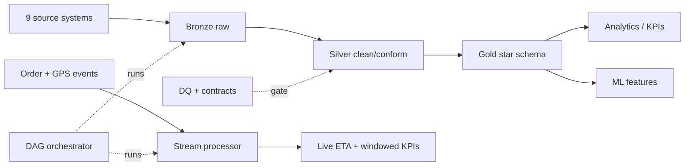

# FreshCart — End-to-End Data Engineering Project (Grocery + Last-Mile Logistics)

A **runnable, portfolio-grade** data platform for a fictional online-grocery + delivery
company (an Instacart / Amazon Fresh / DoorDash / Gopuff analog). Built to demonstrate
every layer a data engineer is hired to own — and to be the project you *talk about* to
land the job. Runs end-to-end on a laptop for **$0**; every component maps 1:1 to a real
production tool.

> Why this domain: grocery + logistics forces you to handle high-volume transactions,
> real-time GPS streams, perishable inventory, cold-chain IoT, geospatial delivery, and
> messy multi-source data — i.e. all the hard things, in one coherent story.

## What's inside (the full stack)



- **Medallion lakehouse**: bronze -> silver -> gold (Parquet + DuckDB).
- **Kimball star schema**: conformed dims + fact tables with surrogate keys & business measures.
- **Batch ELT** with data-quality gates and **quarantine** (no silent data loss).
- **Streaming**: event-time windows, **watermarks**, exactly-once dedup, live ETA, late side-output.
- **Data contracts** to catch upstream schema drift.
- **Orchestration DAG** with retries, downstream short-circuit, and a **freshness SLA**.
- **Tests** (data invariants + unit) wired into **CI/CD**.
- **IaC (Terraform)** + **Docker** for reproducible deployment.
- **Analytics KPIs** + leak-free **ML feature** tables (ETA + demand forecasting).

## Quickstart

```bash
cd projects/grocery-logistics-de
pip install -r requirements.txt

# Option A: run the whole platform as one orchestrated DAG
python src/orchestrate.py

# Option B: run each stage yourself
python src/generate_data.py      # 1. ~200k rows across 9 source systems
python src/contracts.py          # 2. validate source data contracts
python src/run_pipeline.py       # 3. bronze -> silver -> gold + 12 DQ checks
python src/stream_simulator.py   # 4. produce real-time events
python src/stream_processor.py   # 5. stateful streaming -> live ETA + windows
python src/analytics.py          # 6. business KPIs (GMV, on-time %, stockout...)
python src/ml_features.py        # 7. ML feature tables

# Tests
python -m unittest discover -s tests
```

Outputs land in `data/` (lake Parquet, DuckDB warehouse, `_metrics/*.json`, streaming `_state/`).

## Repo layout

```
grocery-logistics-de/
├── README.md
├── requirements.txt
├── Dockerfile                 # reproducible image (CI builds, MWAA/ECS runs)
├── docs/                      # the narrative: read these in order
│   ├── 00-overview.md         #   charter, business, source systems, roadmap
│   ├── 01-architecture.md     #   medallion design + local->prod mapping table
│   ├── 02-data-model.md       #   star schema, grain, SCD, surrogate keys
│   ├── 03-batch-pipeline.md   #   bronze/silver/gold ELT + DQ + quarantine
│   ├── 04-streaming.md        #   event-time, watermarks, exactly-once, ETA
│   ├── 05-orchestration-observability.md  # DAG, contracts, lineage, SLAs, tests
│   ├── 06-productionization.md            # IaC, CI/CD, Docker, scaling, cost, ML
│   └── 07-interview-guide.md  #   how to present it + Q&A mapping + resume bullets
├── src/                       # all runnable code
│   ├── common.py              #   paths/config
│   ├── generate_data.py       #   synthetic source extracts (with injected defects)
│   ├── run_pipeline.py        #   batch ELT bronze->silver->gold
│   ├── dq.py                  #   data-quality engine
│   ├── contracts.py           #   data-contract validator
│   ├── stream_simulator.py    #   event producer
│   ├── stream_processor.py    #   stateful stream consumer
│   ├── analytics.py           #   KPI / serving layer
│   ├── ml_features.py         #   feature engineering
│   └── orchestrate.py         #   the DAG runner
├── contracts/                 # JSON data contracts per source dataset
├── infra/                     # Terraform (S3 lake, MSK, ECR, CloudWatch SLA)
├── cicd/ci.yml                # GitHub Actions pipeline (lint/test/build/plan)
├── tests/                     # data-invariant + unit tests
└── data/                      # generated (gitignored)
```

## Local -> production mapping (the headline)

| Concern | This project | Production |
|---|---|---|
| Lake storage / format | Parquet + DuckDB | S3/GCS + **Iceberg/Delta** |
| Warehouse | DuckDB | **Snowflake / BigQuery / Databricks** |
| Batch transforms | SQL in `run_pipeline.py` | **dbt** + **Spark** |
| Streaming | micro-batch loop | **Kafka/Kinesis + Flink/Spark** |
| Orchestration | `orchestrate.py` | **Airflow / Dagster / Prefect** |
| Data quality / contracts | `dq.py` / `contracts/` | **Great Expectations / dbt tests / Soda** |
| Infra / CI/CD | Terraform / GitHub Actions | same, on a cloud account |

Full details and per-iteration writeups are in [`docs/`](docs/). Start with
[docs/00-overview.md](docs/00-overview.md).

## Honesty notes
- All data is **synthetic** (deterministic, seeded). No real customer/PII data.
- Cloud `infra/` uses placeholder values and isn't applied; it documents the target shape.
- "Big company" comparisons describe well-known public architectures, not internal data.
