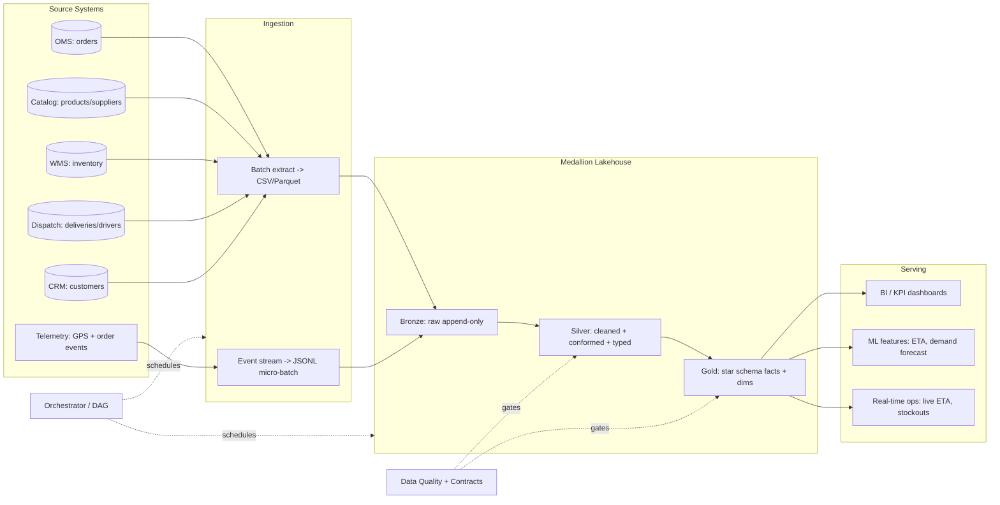
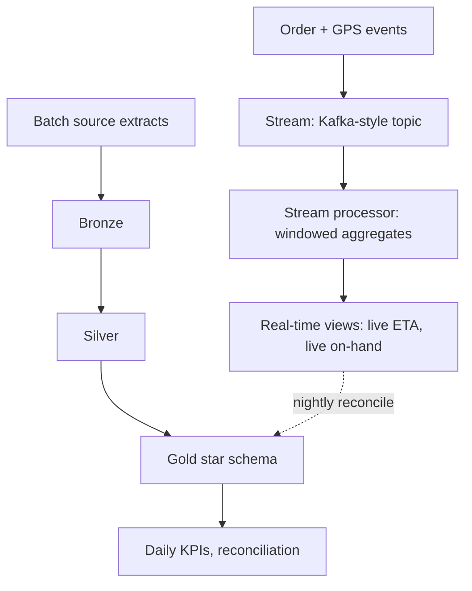

# FreshCart — Architecture

## 1. End-to-end system (logical)

## 2. The medallion (bronze/silver/gold) pattern and *why*

This is the single most common modern data architecture (Databricks coined "medallion"; the same idea is "raw/staging/marts" in dbt and "landing/cleansed/curated" elsewhere). Each layer has one job:

| Layer | Purpose | Rules | FreshCart example |
|---|---|---|---|
| **Bronze** | Capture source *exactly*, append-only, never lose data | No business logic. Add load metadata (`_ingested_at`, `_source_file`). Schema-on-read. | Verbatim copy of `orders.csv` -> `bronze/orders` |
| **Silver** | Make data *trustworthy*: clean, dedup, type-cast, conform keys, reject bad rows | Idempotent. Bad rows -> quarantine, not dropped silently. | Dedup duplicate orders, cast `order_ts` to timestamp, drop negative quantities to quarantine |
| **Gold** | Make data *useful*: business-shaped star schema | Joins, aggregations, surrogate keys, conformed dimensions. | `fct_order_items`, `dim_product`, `dim_date` |

**Why three layers instead of one transform?** Separation of concerns + replayability. If a gold KPI looks wrong, you can re-derive gold from silver without re-pulling sources; if silver logic has a bug, you re-derive it from immutable bronze. This is *idempotency* and *reproducibility*, the things that separate a pipeline from a script.

## 3. Local stack -> production stack mapping (the interview-critical table)

The project runs on a laptop for $0, but every component maps 1:1 to a real cloud tool. **This table is the heart of the "matches big companies" requirement.**

| Concern | This project (local) | Real production equivalents |
|---|---|---|
| Object storage / lake | local `data/lake/*.parquet` | **S3 / GCS / ADLS** |
| Lake table format | Parquet files + DuckDB views | **Delta Lake / Apache Iceberg / Hudi** |
| Warehouse / query engine | **DuckDB** | **Snowflake / BigQuery / Redshift / Databricks SQL** |
| Batch transforms | Python + SQL (`run_pipeline.py`) | **dbt** + **Spark** |
| Streaming ingest | JSONL micro-batch (`stream_simulator.py`) | **Apache Kafka / Kinesis / Pub/Sub** |
| Stream processing | Python windowed micro-batch | **Apache Flink / Spark Structured Streaming** |
| Orchestration | dependency DAG (`orchestrate.py`) | **Apache Airflow / Dagster / Prefect** |
| Data quality | DQ check engine (`dq.py`) | **Great Expectations / dbt tests / Soda** |
| Data contracts | JSON schema + checks | **dbt contracts / Protobuf+Schema Registry** |
| Infra | Terraform stubs (Iteration 5) | **Terraform** on AWS/GCP |
| CI/CD | GitHub Actions workflow | **GitHub Actions / GitLab CI** |
| Containerization | Dockerfile | **Docker + Kubernetes / ECS** |
| BI / serving | SQL queries + KPI views | **Looker / Tableau / Power BI / Superset** |

## 4. Batch vs streaming (the Lambda-ish split)

FreshCart needs both:

- **Batch path** (hourly/daily): full historical accuracy for finance, supply chain, cohorts. Tolerates minutes-to-hours latency.
- **Streaming path** (seconds): live driver ETA, live stockout alerts, "where is my order." Needs low latency, tolerates eventual correction.

The streaming results are *reconciled* against the authoritative batch gold tables nightly — a standard pattern so the fast-but-approximate real-time numbers don't permanently diverge from the slow-but-correct batch numbers.

## 5. Data flow guarantees we design for

- **Idempotency:** re-running any step produces the same output (safe retries). Achieved via deterministic dedup keys + full-refresh/merge semantics.
- **At-least-once -> exactly-once-effect:** upstream may deliver duplicates; silver dedup makes the *effect* exactly-once.
- **Schema evolution:** bronze tolerates new columns; silver enforces a contract and flags drift.
- **Backfill:** because bronze is immutable history, any silver/gold table can be rebuilt for any date range.

Next: [02-data-model.md](02-data-model.md) for the dimensional schema.
