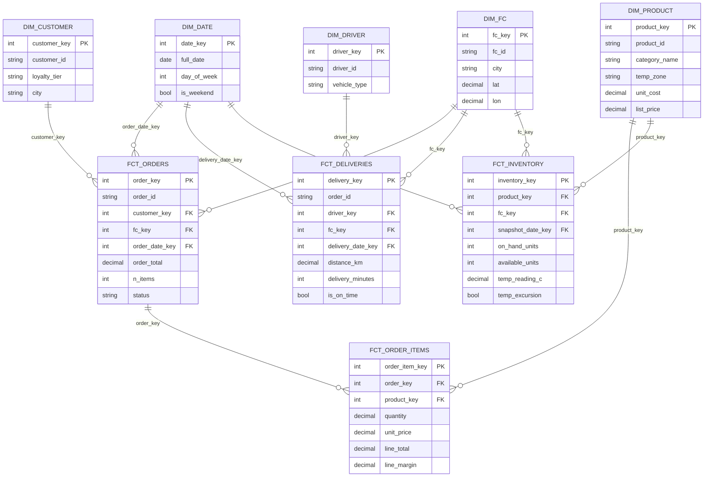

# FreshCart — Dimensional Data Model (Gold Layer)

We model the gold layer as a **Kimball star schema**: central **fact** tables (events/measurements) surrounded by **dimension** tables (the "who/what/where/when" context). This is what BI tools and analysts expect, and "can you design a star schema" is a near-universal DE interview question.

## 1. Star schema (ERD)

## 2. Grain (the most important modeling decision)

Every fact table must have one clearly-stated **grain** (what one row means). Getting grain wrong is the #1 cause of double-counted metrics.

| Fact table | Grain (one row =) | Type | Additive measures |
|---|---|---|---|
| `fct_orders` | one customer order | transaction | order_total, n_items |
| `fct_order_items` | one product line within an order | transaction | quantity, line_total, line_margin |
| `fct_deliveries` | one delivery attempt | transaction | distance_km, delivery_minutes |
| `fct_inventory` | one product x FC x day | **periodic snapshot** | on_hand_units, available_units |

`fct_inventory` is a classic **periodic snapshot fact** (state sampled daily); the others are **transaction facts** (one row per business event). Knowing this distinction is a strong interview signal.

## 3. Derived measures (business logic lives in gold)

| Measure | Definition | Serves |
|---|---|---|
| `line_margin` | `line_total - quantity * unit_cost` | Finance: contribution margin |
| `delivery_minutes` | `delivered_ts - dispatch_ts` | Ops: speed |
| `is_on_time` | `delivered_ts <= promised_delivery_ts` | Ops: on-time delivery % |
| `available_units` | `on_hand_units - reserved_units` | Supply chain: true availability |
| `temp_excursion` | reading outside zone band (frozen <= -12, chilled 0–6, ambient 10–27) | Compliance |

## 4. Slowly Changing Dimensions (SCD)

Reference data changes over time. We treat:

- `dim_product` price/cost as **SCD Type 2** in production (keep history: a row's `list_price` should reflect the price *at order time*, not today's price). In this local build we keep the latest (Type 1) for simplicity and document where Type 2 plugs in (Iteration 5 notes).
- `dim_customer.loyalty_tier` as **SCD Type 2** (tier at time of order matters for cohort analysis).

> Why it matters: if you overwrite a product's price (Type 1) you'll mis-state historical margin. Recognizing when Type 2 is required is exactly what the "design a dimension" interview question probes.

## 5. Surrogate keys

Gold dimensions use integer **surrogate keys** (`product_key`) instead of the natural business key (`product_id`). Reasons: (1) decouples the warehouse from source-key changes, (2) enables SCD Type 2 (same `product_id`, multiple `product_key` versions over time), (3) faster joins. Facts carry the surrogate key resolved at load time.

## 6. Conformed dimensions

`dim_date`, `dim_product`, and `dim_fc` are **conformed** — shared across multiple fact tables with identical meaning — so you can ask cross-process questions ("inventory vs. sales for the same product/FC/day") without re-joining raw tables. This is the payoff of dimensional modeling.

Next: the batch pipeline that builds all of this — [03-batch-pipeline.md](03-batch-pipeline.md).
