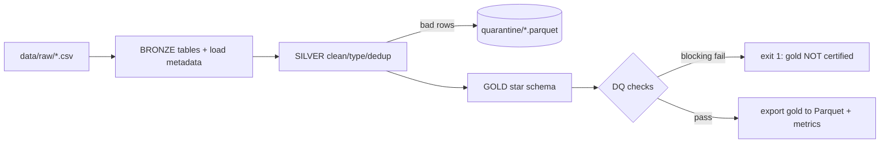

# FreshCart — Batch ELT Pipeline (Iteration 2)

Code: [`src/run_pipeline.py`](../src/run_pipeline.py), [`src/dq.py`](../src/dq.py). Run with `python src/run_pipeline.py`.

## 1. What it does, step by step

### Step 1 — Bronze (extract & land)
Each `data/raw/*.csv` is loaded **verbatim** into a `bronze.*` table, plus two audit columns every real lake adds: `_ingested_at` (when we loaded it) and `_source_file` (where it came from). No business logic — bronze is the immutable system of record you can always replay from.

### Step 2 — Silver (clean, conform, dedup, quarantine)
This is where messy reality is tamed. Concretely, on this dataset silver:

- **Deduplicates** at-least-once CDC duplicates (`DISTINCT ON (order_id)`), e.g. orders 27,135 -> 26,983.
- **Type-casts** strings to real `TIMESTAMP`/`DECIMAL`/`DATE` so math and time logic work.
- **Quarantines** (never silently drops) bad rows into `data/lake/_quarantine/*.parquet` with a `_quarantine_reason`:
  - `null_fc_id` (orders missing a fulfillment center) — 12 rows
  - `future_timestamp` (clock-skewed orders dated 2027) — 5 rows
  - `non_positive_qty_or_price` (negative/zero order lines) — 40 rows
- **Enforces referential integrity** (order_items must reference a surviving order).

> Quarantine-don't-drop is a production best practice: bad rows are evidence. Analysts and upstream teams can inspect the quarantine to find the root cause, and you can reprocess once it's fixed.

### Step 3 — Gold (dimensional star schema)
Builds conformed dimensions (`dim_date`, `dim_customer`, `dim_product`, `dim_fc`, `dim_driver`) with integer **surrogate keys**, and fact tables (`fct_orders`, `fct_order_items`, `fct_deliveries`, `fct_inventory`) that resolve those keys and compute business measures:
- `line_margin = line_total - quantity * unit_cost`
- `delivery_minutes`, `is_on_time = delivered_ts <= promised_delivery_ts`
- `available_units = on_hand - reserved`, `temp_excursion` (cold-chain band check)

### Step 4 — Data quality gate
`src/dq.py` runs 12 checks (uniqueness, not-null, non-negative, FK relationships, accepted values, row-count minimums). **BLOCKING** failures `exit 1` and the gold layer is *not* certified — so a bad load never silently poisons dashboards. **WARN** failures (e.g. <10% null emails) are logged but don't stop the run.

### Step 5 — Export
Gold tables are written to `data/lake/gold/*.parquet` (the serving lake) and a full run report is written to `data/_metrics/last_run.json` (row counts, quarantine counts, every DQ result, elapsed time).

## 2. Why ELT, not ETL?
We **E**xtract and **L**oad raw into the warehouse/lake first (bronze), then **T**ransform inside it (silver/gold). Modern warehouses (Snowflake/BigQuery/DuckDB) are powerful enough to transform at scale, so ELT lets you keep raw history, transform with SQL/dbt, and re-derive marts without re-extracting. This is the dominant modern pattern.

## 3. Idempotency & backfill
Every table uses `CREATE OR REPLACE`, and dedup/casting are deterministic, so re-running produces byte-identical gold. Because bronze is immutable, any silver/gold table (or any date range) can be **backfilled** by replaying — the property that makes pipelines trustworthy.

## 4. How this maps to a real stack
| Here | Production |
|---|---|
| `run_pipeline.py` SQL | **dbt models** (`staging/` = silver, `marts/` = gold) |
| DuckDB | **Snowflake / BigQuery / Databricks SQL** |
| `dq.py` | **dbt tests / Great Expectations / Soda** |
| `COPY ... TO parquet` | writing **Delta/Iceberg** tables to **S3/GCS** |
| `last_run.json` | run metadata in **Airflow/Dagster** + a metrics store |

The SQL is intentionally standard analytical SQL; porting these models to dbt is mostly moving each `CREATE OR REPLACE TABLE` into a `.sql` model file and converting the DQ functions into dbt's `tests:` blocks.

Next: real-time events — [04-streaming.md](04-streaming.md).
