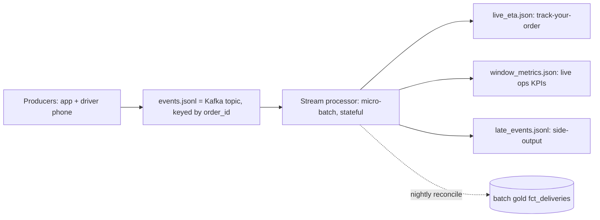

# FreshCart — Real-Time Streaming Layer (Iteration 3)

Code: [`src/stream_simulator.py`](../src/stream_simulator.py) (producer), [`src/stream_processor.py`](../src/stream_processor.py) (consumer).
Run: `python src/stream_simulator.py && python src/stream_processor.py`.

## 1. The use case
When you tap "track my order," FreshCart must answer in **seconds**: where is the driver, what's the ETA, did we hit the promise? The batch star schema (correct but hours-old) can't do this. So we add a streaming path.

## 2. The events
- **Order lifecycle**: `order_placed -> picking_started -> dispatched -> en_route (gps_ping...) -> delivered`
- **Driver GPS pings**: lat/lon/speed while en route, plus the destination.

Partitioned by `order_id` (Kafka key) so all events for one order are processed in order on one partition — the standard way to keep per-entity ordering at scale.

## 3. The five streaming concepts this demonstrates (interview gold)

| Concept | Problem it solves | How the processor does it | Result in this run |
|---|---|---|---|
| **Exactly-once effect** | Upstream is at-least-once; duplicates would double-count | Idempotent dedup on `event_id` | **8 duplicates deduped** |
| **Event-time + watermark** | Events arrive out of order; processing-time windows would be wrong | Window on `event_time`; watermark = `max_event_time - allowed_lateness` | results correct despite ~20s jitter |
| **Tumbling windows** | Need per-interval KPIs (delivered/min, on-time%) | 10-minute event-time windows | **9 windows, 7 closed by watermark** |
| **Allowed lateness + side-output** | Very-late events shouldn't corrupt a closed window, but shouldn't vanish | Route post-watermark events to `late_events.jsonl` | **5 late events captured** |
| **Stateful processing** | Live ETA needs the latest position per order | Per-`order_id` state with last GPS ping -> haversine ETA | **320 orders tracked, ETA MAE ~5 min** |

> **Event time vs processing time** is the single most-tested streaming concept. *Event time* = when the GPS ping actually happened on the driver's phone. *Processing time* = when our server saw it. Mobile networks buffer and retry, so events arrive late and out of order. Windowing on event time + a watermark is what makes "deliveries between 5:10–5:20pm" correct even if some of those pings land at 5:23pm.

## 4. Live ETA computation
For each `gps_ping`: `remaining_km = haversine(current, destination)`, `eta_min = remaining_km / max(speed, 6) * 60`. The latest value per order is written to `live_eta.json`. When `delivered` arrives, we compare the last predicted arrival to the actual time to produce an **ETA accuracy (MAE)** metric — exactly the feedback signal a real ETA-model team monitors and retrains on.

## 5. Micro-batch = checkpoint boundary
The processor consumes the topic in micro-batches of 250 events; each batch is analogous to a **Spark Structured Streaming micro-batch** or a **Flink checkpoint**. State (dedup set, per-order status, open windows) survives across batches, which is how a real stateful job recovers after a restart (in production that state is persisted to RocksDB / checkpoint storage).

## 6. Reconciliation with batch (Lambda pattern)
Streaming numbers are fast but approximate (late data, restarts). The authoritative `fct_deliveries` in gold is slow but correct. In production a nightly job reconciles the real-time on-time-rate against the batch on-time-rate and alerts if they diverge beyond a threshold — so the dashboards customers/ops watch never permanently drift from the books.

## 7. Local -> production mapping
| Here | Production |
|---|---|
| `events.jsonl` consumed by offset | **Kafka / Kinesis / Pub-Sub** topic + consumer group |
| micro-batch loop in `stream_processor.py` | **Spark Structured Streaming** / **Apache Flink** |
| in-memory dedup + state dicts | Flink keyed state / RocksDB, or Spark stateful ops |
| `live_eta.json` | a low-latency store: **Redis / DynamoDB / Cassandra** |
| `window_metrics.json` | a real-time OLAP store: **Apache Druid / Pinot / ClickHouse** |
| `late_events.jsonl` | Flink **side output** / Kafka dead-letter topic |

Next: tying batch + streaming together with orchestration, contracts, and observability — [05-orchestration-observability.md](05-orchestration-observability.md).
