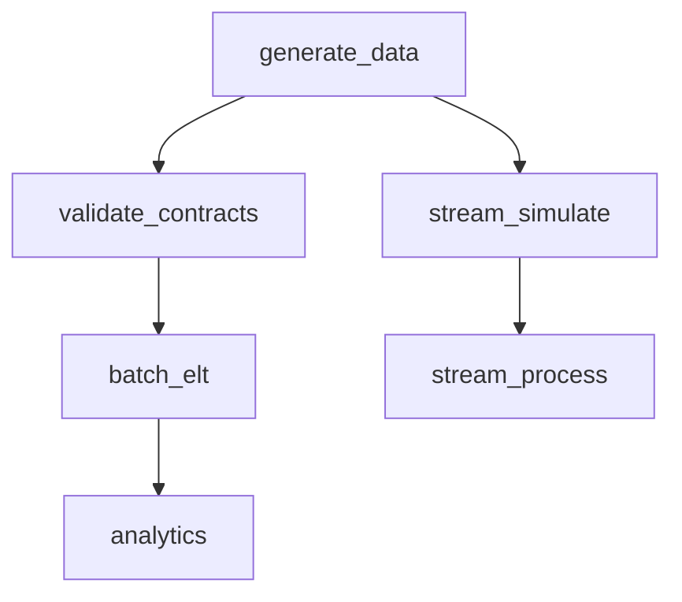

# FreshCart — Orchestration, Data Contracts & Observability (Iteration 4)

Code: [`src/orchestrate.py`](../src/orchestrate.py), [`src/contracts.py`](../src/contracts.py), [`contracts/*.json`](../contracts), [`tests/test_pipeline.py`](../tests/test_pipeline.py).
Run the whole platform: `python src/orchestrate.py`. Run tests: `python -m unittest discover -s tests`.

## 1. The DAG (orchestration)
`orchestrate.py` is a teaching-sized Airflow/Dagster: it defines the pipeline as a **directed acyclic graph** of tasks, runs them in **topological order**, retries failures, short-circuits downstream tasks when an upstream fails, and logs structured run metadata.

Observed run: `generate_data -> stream_simulate -> stream_process -> validate_contracts -> batch_elt -> analytics`, **succeeded in ~23s**.

Key orchestration behaviors (all standard Airflow/Dagster concepts):
- **Dependencies**: a task starts only after all `deps` succeed.
- **Retries**: `attempts = retries + 1` with the error captured.
- **Short-circuit**: if `batch_elt` failed, `analytics` is **skipped**, not run on stale data.
- **Branch isolation**: the streaming branch and batch branch are independent, so a streaming failure wouldn't block batch (and vice versa). They could run **in parallel**.
- **Run history**: every run appends to `data/_metrics/dag_runs.jsonl` for trend analysis.

## 2. Data contracts
`contracts/*.json` declare what each source dataset promises (schema, keys, value domains, freshness). `contracts.py` validates incoming extracts against them **before** the ELT runs.

Severity model (matches production reality):
- **STRUCTURAL drift** (required column missing / unparseable) -> **BLOCKING**: stop before corrupting downstream.
- **Row-level violations** (null-rate, min, accepted-values, dup keys) -> **WARN**: recorded for alerting, but the silver layer + quarantine already handle individual bad rows.

> Why contracts *and* DQ checks? Contracts catch **producer changes** at the boundary ("the OMS team renamed a column"). DQ checks (Iteration 2) catch **data defects** inside your pipeline. Both are needed; together they're the difference between "the dashboard silently went wrong" and "we got paged the moment upstream drifted."

## 3. Observability — what we emit
A platform you can't see into is a platform you can't operate. Every run writes machine-readable signals:

| Signal | File | Answers |
|---|---|---|
| Run status / per-task timing | `data/_metrics/last_dag_run.json` | Did it run? What was slow? |
| Run history | `data/_metrics/dag_runs.jsonl` | Is runtime trending up? Flaky tasks? |
| Pipeline metrics | `data/_metrics/last_run.json` | Row counts, quarantine counts, every DQ result |
| Contract results | `data/_metrics/contract_validation.json` | Did a source drift? |
| **Freshness SLA** | in `last_dag_run.json` | Is gold within 24h of now? (observed lag ~8h -> within SLA) |
| Streaming health | `data/streaming/_state/*` | Dedup count, late events, ETA accuracy |

These map to the **three pillars**: metrics (counts/rates), logs (task stdout/errors), and lineage (which source -> which table). In production these feed **Datadog / Prometheus / Grafana / OpenLineage / Monte Carlo**.

## 4. Lineage
The medallion layering *is* the lineage graph: `raw -> bronze -> silver -> gold -> mart`. Each table's provenance is explicit in `run_pipeline.py` (the `FROM` clauses). In production a tool like **OpenLineage / dbt docs / DataHub** auto-extracts this so you can answer "if `bronze.orders` is late, which dashboards are affected?"

## 5. Testing
`tests/test_pipeline.py` (10 tests, all passing) covers two test types every DE repo needs:
- **Data invariants** on the built warehouse: unique surrogate keys, no orphan dimension keys, `line_total == quantity*unit_price`, `available_units == on_hand - reserved`, contiguous `dim_date`, on-time-rate within [0,100].
- **Pure logic**: the haversine ETA distance function (zero distance + a known Chicago–NY distance).

CI runs these on every push (Iteration 5), so a change that breaks an invariant fails the build *before* merge.

## 6. Local -> production mapping
| Here | Production |
|---|---|
| `orchestrate.py` DAG | **Apache Airflow / Dagster / Prefect** |
| retries / short-circuit / SLA | Airflow `retries`, `trigger_rule`, SLAs |
| `contracts/*.json` + `contracts.py` | **dbt contracts**, **Protobuf + Schema Registry**, **Soda** |
| `*_metrics/*.json` | **Datadog / Prometheus / Grafana / Monte Carlo** |
| medallion lineage | **OpenLineage / DataHub / dbt docs** |
| `tests/` | **pytest + dbt tests** in **CI** |

Next: making it production-grade — [06-productionization.md](06-productionization.md).
