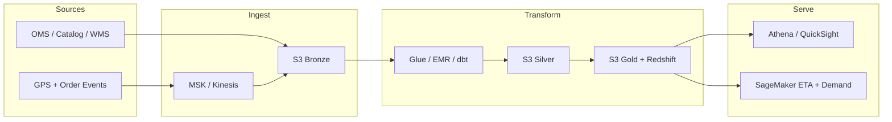

# FreshCart — 30-Day AWS Data Engineering Curriculum

> Day-by-day learning path from project planning through ML model deployment on AWS.
> Uses this repo as the hands-on spine; each local component maps 1:1 to a production AWS service.

**Target outcome:** Explain, build, and deploy an end-to-end logistics data platform on AWS — from source ingestion through ML model serving — and present it confidently in an AI Data Engineer interview.

**Daily rhythm (~1–2 hours):** Read (20 min) → Do (45–60 min) → AWS mapping (15 min) → Log 3 bullets (10 min).

---

## Architecture Target (AWS)



### Local → AWS mapping (reference)

| Local | AWS Production |
|---|---|
| `data/lake/*.parquet` | **S3** + **Glue Catalog** |
| DuckDB | **Athena** or **Redshift Serverless** |
| `run_pipeline.py` | **Glue ETL** / **EMR Spark** / **dbt on Redshift** |
| `stream_simulator.py` | **MSK** (Kafka) or **Kinesis** |
| `orchestrate.py` | **MWAA** (Managed Airflow) |
| `dq.py` | **Great Expectations** + **Glue Data Quality** |
| `Dockerfile` | **ECR** + **ECS/Fargate** |
| `ml_features.py` | **SageMaker Feature Store** |

---

## Week 1 — Planning, Domain, Architecture (Days 1–7)

| Day | Topic | Read | Do | Deliverable |
|---|---|---|---|---|
| **1** | Charter & stakeholders | [00-overview.md](00-overview.md) §1–3 | Write 1-page charter; run `generate_data.py` | 60-second pitch |
| **2** | Source systems & contracts | [00-overview.md](00-overview.md) §4, `contracts/` | Run `contracts.py`; break a column name | Source → contract table |
| **3** | Medallion architecture | [01-architecture.md](01-architecture.md) §2–5 | Inspect `data/lake/{bronze,silver,gold}/` | Explain idempotency + backfill |
| **4** | Star schema | [02-data-model.md](02-data-model.md) | Query gold facts/dims; write 3 stakeholder SQL questions | Star diagram with grain |
| **5** | Local → AWS mapping | [01-architecture.md](01-architecture.md) §3 | Fill mapping table from memory | Recite 60-second pitch ([07-interview-guide.md](07-interview-guide.md) §1) |
| **6** | Batch vs streaming | [01-architecture.md](01-architecture.md) §4, [04-streaming.md](04-streaming.md) intro | List latency needs; sketch nightly reconciliation | Batch + stream diagram |
| **7** | Week 1 review | — | `python src/orchestrate.py` + full test suite | Full pipeline green |

---

## Week 2 — Batch ELT, Data Quality, Silver/Gold (Days 8–14)

| Day | Topic | Read | Do | Deliverable |
|---|---|---|---|---|
| **8** | Bronze ingest | [03-batch-pipeline.md](03-batch-pipeline.md) | Trace `_ingested_at`; re-run bronze twice | Why bronze never drops rows |
| **9** | Silver clean/dedup | [03-batch-pipeline.md](03-batch-pipeline.md) | Inspect quarantine; count rejected rows | 5 silver transforms + justification |
| **10** | Gold star schema | [02-data-model.md](02-data-model.md) | Query GMV, on-time %, stockout from gold | 5 gold SQL queries |
| **11** | Data quality engine | `src/dq.py` | List 12 checks; inject bad row → `exit 1` | 3 new DQ checks you'd add |
| **12** | Data contracts | `src/contracts.py`, `contracts/` | Add optional field; remove required field | New `driver_shifts` contract |
| **13** | Analytics KPIs | `src/analytics.py`, [06-productionization.md](06-productionization.md) §4 | Run analytics; read `kpis.json` | KPI table with stakeholder + SQL |
| **14** | Week 2 review | [07-interview-guide.md](07-interview-guide.md) §4 story A | Rehearse quarantine + DQ story (2 min) | Batch deep-dive story bullets |

---

## Week 3 — Streaming, Orchestration, Observability (Days 15–21)

| Day | Topic | Read | Do | Deliverable |
|---|---|---|---|---|
| **15** | Event-time vs processing-time | [04-streaming.md](04-streaming.md) §1–2 | Read `stream_simulator.py` event timestamps | 3-sentence GPS event-time explanation |
| **16** | Watermarks & late data | [04-streaming.md](04-streaming.md) §3, `stream_processor.py` | Run simulator + processor; find side-output | Window → watermark → side-output diagram |
| **17** | Exactly-once semantics | [04-streaming.md](04-streaming.md) §4 | Confirm ~8 deduped duplicates in metrics | Exactly-once paragraph for interviews |
| **18** | Live ETA | `stream_processor.py` | Find ETA MAE (~5 min); trace per-order state | Live ETA data flow explanation |
| **19** | Orchestration DAG | `orchestrate.py`, [05-orchestration-observability.md](05-orchestration-observability.md) | Draw DAG; find freshness SLA breach behavior | DAG with retries + SLA alarm |
| **20** | Testing & CI/CD | `tests/`, `cicd/ci.yml` | Run 10 tests; break one intentionally | Test inventory (what each protects) |
| **21** | Week 3 review | [07-interview-guide.md](07-interview-guide.md) §4 story B | Rehearse ETA rush-hour story (2 min) | Combined batch + streaming diagram |

---

## Week 4 — AWS Cloud Migration (Days 22–28)

> **Setup before Day 22:** AWS account, billing alert ($10 cap), AWS CLI + Terraform, region `us-east-1`. Tear down resources nightly.

| Day | Topic | Read | Do | AWS services | Deliverable |
|---|---|---|---|---|---|
| **22** | Terraform & S3 lake | `infra/main.tf`, [06-productionization.md](06-productionization.md) §1 | `terraform init && plan` | S3, IAM | Bucket prefixes or plan output |
| **23** | Athena on S3 gold | — | Upload gold Parquet; Glue Crawler; Athena KPI query | Athena, Glue Catalog | One KPI query in Athena |
| **24** | ECR container | `Dockerfile`, `infra/main.tf` | `docker build` + push to ECR | ECR, ECS/Fargate | Image in ECR |
| **25** | MSK or Kinesis | `infra/main.tf` MSK | Adapt `stream_simulator.py` → Kinesis/MSK → S3 bronze | Kinesis or MSK | Events in cloud bronze |
| **26** | Glue ETL or MWAA | — | Port one silver transform OR minimal Airflow DAG | Glue, MWAA | One scheduled cloud job |
| **27** | Observability & SLA | CloudWatch alarm in `infra/` | Alarm on gold staleness → SNS email | CloudWatch, SNS | Freshness alarm |
| **28** | Week 4 review | — | Draw full AWS architecture; note costs | — | Architecture diagram + cost notes |

### AWS cost control

| Resource | Tip |
|---|---|
| S3, Athena | Safe for learning; use `LIMIT` + partitions |
| Glue crawlers | Stop after use |
| MSK, MWAA, Redshift | Expensive — prefer Kinesis + Glue Python shell |
| SageMaker endpoints | **Delete after testing** — hourly compute |
| NAT Gateway | Avoid; use VPC endpoints |

---

## Week 5 — ML Features & Model Deployment (Days 29–30)

| Day | Topic | Read | Do | Deliverable |
|---|---|---|---|---|
| **29** | Feature engineering | `ml_features.py`, [06-productionization.md](06-productionization.md) §5 | Inspect `feat_eta` + `feat_demand`; verify corr ≈ 0.907 | Leakage example explained |
| **30** | SageMaker deploy | — | Train XGBoost on `feat_eta` → endpoint; test inference; optional demand batch transform | Deployed ETA endpoint + retrain trigger |

### ML use cases (AI Data Engineer story)

| Model | Business value | Feature table | AWS serve |
|---|---|---|---|
| **Delivery ETA** | Customer UX, dispatch | `feat_eta` | SageMaker real-time endpoint |
| **Demand forecast** | Stockout prevention | `feat_demand` | SageMaker batch transform → WMS |

**Interview line:**
> "I built the full data platform — ingestion, quality gates, star schema, streaming ETA, leak-free feature tables — and deployed the ETA regressor on SageMaker with a freshness SLA and retrain trigger tied to MAE drift."

---

## After Day 30 — Stretch goals

1. Convert SQL transforms to **dbt** models + dbt tests
2. Swap Parquet for **Apache Iceberg** on S3
3. **QuickSight** dashboard for ops KPIs
4. **Step Functions** for ML retrain pipeline
5. **Streamlit** app calling SageMaker endpoint

---

## Quickstart (Day 1)

```bash
cd projects/grocery-logistics-de
pip install -r requirements.txt
python src/generate_data.py
ls data/source/
```

Then work through the day table above. Say **"Day N"** in a session for deep-dive teaching on that day's topic.
