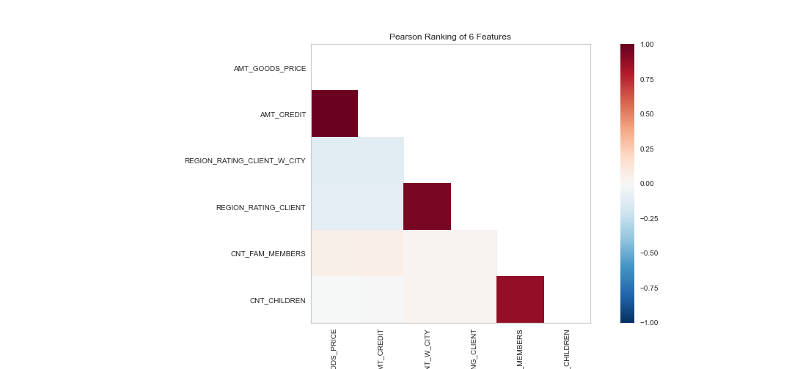
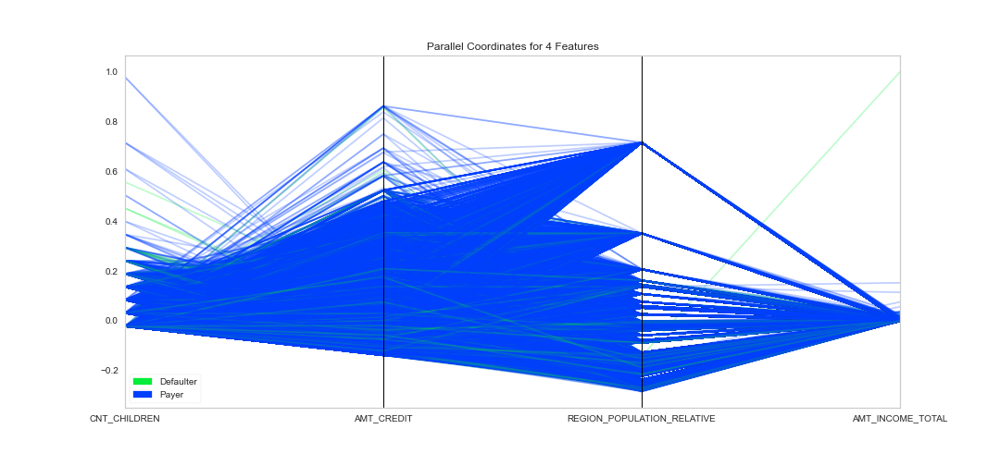

# Loan Default Risk Analysis

**Credit-risk EDA and imbalanced classification** on the [Home Credit Default Risk](https://www.kaggle.com/c/home-credit-default-risk) application table. The goal is not “high accuracy.” It is to **identify applicants who are likely to miss payment** so a lender can reduce credit loss without turning away too many good borrowers.

When a bank decides on an application, two costs compete:

| Decision error | Business impact |
|---|---|
| Approve a future defaulter (false negative) | Credit loss — principal, collections, capital |
| Reject a future repayer (false positive) | Lost interest income and market share |

A model that always predicts “will pay” is ~92% accurate on this data and useless. This project is built around that fact.

**Notebook:** [`Loan Defaulter Analysis.ipynb`](./Loan%20Defaulter%20Analysis.ipynb)

---

## Problem

Home Credit serves borrowers who often have **thin or non-traditional credit files**. The question:

> Given demographics, income, loan terms, and application attributes, how likely is this applicant to default (`TARGET = 1`)?

This is a **probability of default (PD)** problem: class imbalance, overlapping classes, and a cost-sensitive decision — not a balanced accuracy contest.

---

## Dataset

| Item | Value |
|---|---|
| Source | Kaggle Home Credit Default Risk — `application_data.csv` |
| Size | **307,511** applications × **122** columns |
| Target | `TARGET`: `1` = payment difficulty, `0` = paid as agreed |
| Default rate | **8.07%** (~1 in 12) |
| After cleaning | ~307k rows; sparse housing fields dropped; `EXT_SOURCE_2/3` kept |

The table is not in this repo (it is ~100MB+). Download it from Kaggle and place `application_data.csv` next to the notebook.

---

## Approach

1. **Business framing** — treat default as the rare, expensive class; do not optimize accuracy.
2. **Data hygiene** — drop columns with ≥50% missing values; drop IDs, document flags, and process timestamps. **Keep `EXT_SOURCE_2` and `EXT_SOURCE_3`.**
3. **EDA** — default rates by age, gender, contract type, education, and income decile; multicollinearity among amount and region fields.
4. **Sentinel** — `DAYS_EMPLOYED = 365243` is unemployed / pensioner, not a thousand years of tenure.
5. **Features** — annuity-to-income, credit-to-income, credit-to-goods; employment years; education and occupation. Gender stays in EDA and **out of the model**.
6. **Leakage-safe fit** — stratified 75/25 split; `Pipeline` + `ColumnTransformer` so imputation and one-hot encoding fit on **train only**.
7. **Imbalance** — majority dummy vs logistic (unweighted / `class_weight='balanced'` / train-only oversampling) vs histogram gradient boosting.
8. **Evaluation** — default-class precision / recall / F1, **ROC-AUC, PR-AUC, KS, Gini**, then a **cost-weighted threshold** (missed default costs 5× a false reject).

Train / test split for the PD model: **75 / 25**, stratified, `random_state=10`.

---

## What the data shows

These are the findings I would walk an interviewer through first. They are more important than the model score.

### Default is rare, and it is not random

- Overall default rate ≈ **8.1%**.
- **Age:** Young **11.5%** default vs. Adult **8.7%** vs. Elderly **5.2%**. Risk falls with age.
- **Gender:** Male **10.1%** vs. Female **7.0%**. (XNA is a tiny coded missing group and is not a real “100% payers” story.)
- **Contract type:** cash loans show a higher default share than revolving loans.
- **Education:** lower education is associated with worse repayment.

### Amounts and household size are collinear

Pearson ranking of six numeric fields:



| Pair | Why it matters |
|---|---|
| `AMT_CREDIT` ↔ `AMT_GOODS_PRICE` (~0.99) | Credit is almost the goods price; keep one. |
| `REGION_RATING_CLIENT` ↔ `REGION_RATING_CLIENT_W_CITY` (~0.95) | Near-duplicate region ratings. |
| `CNT_CHILDREN` ↔ `CNT_FAM_MEMBERS` (~0.88) | Family size is children plus adults. |

Keeping both members of a pair inflates coefficient variance in logistic regression and does not add new information.

### Classes overlap in raw amounts



Payers and defaulters sit on top of each other in income and credit amount. A few income outliers stretch the scale. That is why a linear model on a handful of demographic flags cannot separate the classes cleanly — and why **external credit scores (`EXT_SOURCE_*`) and bureau history** are the features that usually move AUC on this dataset.

---

## Model results

**Cautionary baseline (original 6 features):** region rating, children, gender, car, realty — logistic regression after random oversampling. Accuracy **66.2%**, macro F1 **48.2%**, default recall ~**45%**. That result is what you get when you strip out credit signal. It is kept in the write-up so the feature upgrade is visible.

**Current notebook (Part 3):** leakage-safe pipeline on external scores, amounts, burden ratios, employment (with the 365243 flag), education, and occupation.

| Model | Role |
|---|---|
| Dummy (always pay) | ~92% accuracy, **0% default recall** — the number to beat |
| Logistic, no balancing | Interpretable; often ignores defaulters at threshold 0.5 |
| Logistic, `class_weight='balanced'` | Scorecard with coefficients |
| Logistic, train-only oversampling | Same idea as the original notebook, now on real features |
| Histogram gradient boosting | Ranking quality challenger |

Read the **comparison table in the notebook** (ROC-AUC, PR-AUC, KS, Gini, default recall) after you run Part 3. Accuracy falling below 92% is expected: the model is no longer predicting all zeros.

The cost curve then replaces the arbitrary 0.5 cutoff with a stylized **5× loss on missed defaults vs. 1× on false rejects**.

---

## How to run

```bash
# 1. Place application_data.csv in this directory (from Kaggle Home Credit Default Risk)
# 2. Create an environment
python -m venv .venv
source .venv/bin/activate   # Windows: .venv\Scripts\activate

pip install pandas numpy scikit-learn seaborn matplotlib yellowbrick jupyter

jupyter notebook "Loan Defaulter Analysis.ipynb"
```

Restart the kernel and **Run All** after pulling. Part 3 depends on `FLAG_UNEMPLOYED` and `EXT_SOURCE_2/3` from the cleaned frame.

---

## Tech stack

Pandas · NumPy · scikit-learn · Seaborn · Matplotlib · Yellowbrick

---

## What is still next

Already in the notebook: `EXT_SOURCE_2/3`, employment sentinel, burden ratios, train-only `Pipeline`, class weights vs oversampling, histogram boosting, KS/Gini/PR-AUC, and a cost-weighted threshold.

Still portfolio-grade follow-ups:

- **WoE / IV scorecard** so logistic coefficients are regulator-friendly bins
- Join **bureau** and previous-application tables (the rest of Home Credit)
- Nested threshold selection on a validation fold (the cost curve currently uses test scores as a demonstration)
- `requirements.txt`, a saved model artifact, and a small Streamlit / FastAPI PD demo

---

## License

MIT. See [LICENSE](./LICENSE).
